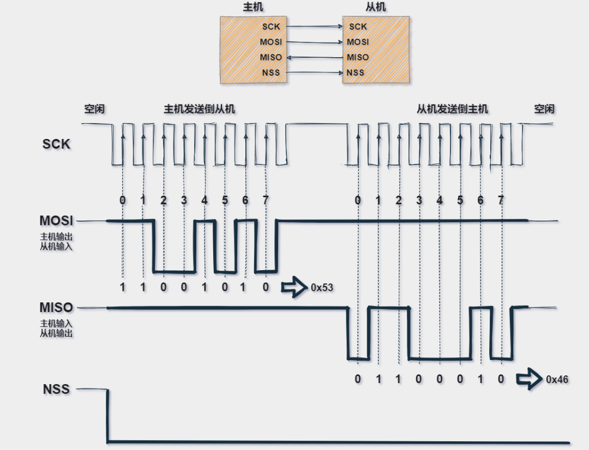
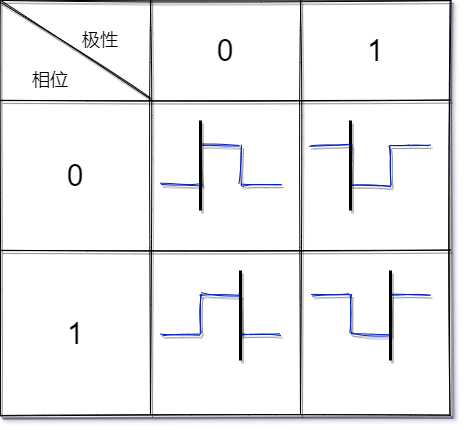

# SPI  

 25Q64  
 QuadSPI 使用AHB3时钟源  
  
 [SPI协议讲解](https://mp.weixin.qq.com/s?__biz=Mzg5MDU1OTgzMw==&mid=2247485675&idx=1&sn=25f8228192051e6f6a8e5c5487dc5e25&source=41#wechat_redirect  "SPI协议讲解")  

## SPI协议  

SPI是一个同步的数据总线，有单独的数据线和单独的时钟信号来保证发送端和接收端的完美同步。  
产生时钟的一侧称为主机，另一侧称为从机。一个主机对应多个从机。  
数据的采集时机可能是时钟信号的上升沿（从低到高）或下降沿（从高到低）。  

## 整体的传输大概可以分为以下几个过程  

主机先将CS信号拉低，从机开始接收数据。  
主机发送到从机时：主机产生时钟信号，主机通过MOSI信号线发送到从机；  
主机接收从机数据：主机产生时钟信号，从机通过MISO信号线发送到主机；  
  

## 通讯模式  

**CPOL时钟极性**  
0 时钟空闲时为低电平  
1 时钟空闲时为高电平  
**CPHA时钟相位**  
0 在时钟信号的第一个跳变沿采样  
1 在时钟信号的第二个跳变沿采样  

  

**通讯模式**  
mode0 [00] CPOL = 0 CPHA = 0  
mode1 [01] CPOL = 0 CPHA = 1  
mode2 [10] CPOL = 1 CPHA = 0  
mode3 [11] CPOL = 1 CPHA = 1  
 [通讯模式讲解](https://zhuanlan.zhihu.com/p/472343748#:~:text=spi%E5%8D%8F%E8%AE%AE%E6%97%B6%E5%BA%8F%E5%9B%BE%E5%92%8C%E5%9B%9B%E7%A7%8D%E6%A8%A1%E5%BC%8F%E5%AE%9E%E9%99%85%E5%BA%94%E7%94%A8%E8%AF%A6%E8%A7%A3%201%201.%E6%A8%A1%E5%BC%8F0%20%28CPOL%3D0%EF%BC%8CCPHA%3D0%29%202%202.%E6%A8%A1%E5%BC%8F1%20%28CPOL%3D0%EF%BC%8CCPHA%3D1%29,3%203.%E6%A8%A1%E5%BC%8F2%20%28CPOL%3D1%EF%BC%8CCPHA%3D0%29%204%204.%E6%A8%A1%E5%BC%8F3%20%28CPOL%3D1%EF%BC%8CCPHA%3D1%29%205%201.%E5%85%88%E7%A1%AE%E5%AE%9A%E8%8A%AF%E7%89%87%E6%94%AF%E6%8C%81%E4%BB%80%E4%B9%88SPI%E5%93%AA%E7%A7%8D%E6%A8%A1%E5%BC%8F%E8%AF%BB%E5%86%99%E6%95%B0%E6%8D%AE    "通讯模式讲解")  

## 25Q64  

## 存储构造  

25Q64（8M）有128个Block （块  64KB）  
每个Block  有 16个Sector（扇区4KB）  
每个Sector 有 16个page  （页  256B）256字节

### /CS  

SPI芯片选择(/CS)引脚启用和禁用设备操作。  
当/CS为高时，设备被取消选择，串行数据输出(DO，或IO0, IO1, IO2, IO3)引脚处于高阻抗。  
当/CS降低时，设备将被选择，  可以向设备写入指令并从设备读取数据。  
**上电后，/CS必须从高电平过渡到低电平，才能接受新的指令。**  
  
### 6.1 SPI通讯模式  

SPI总线工作模式支持0(0,0)和3(1,1)。  
  
使用模式的判断如下：  
对于模式0,CLK信号在/CS的下降沿和上升沿通常是低的。  
对于模式3,CLK信号在/CS的下降沿和上升沿通常是高的。

### 6.2 DualSPI指令  

支持“Fast Read Dual Output (3Bh)”和“Fast Read Dual I/O (BBh)”等指令。  
双SPI读取指令非常适合在上电时快速下载代码到RAM(代码阴影)或直接从SPI总线(XIP)执行非速度关键代码。  
当使用双SPI指令时，DI和DO引脚变成双向I/O引脚:IO0和IO1。

### 6.3 QuadSPI指令  

支持“Fast Read Quad Output (6Bh)”和“Fast Read Quad I/O (EBh)”等指令。  
Quad Read指令在连续和随机访问传输速率方面提供了显着改进，允许快速代码阴影到RAM或直接从SPI总线(XIP)执行。  
当使用Quad SPI指令时，DI和DO引脚变成双向IO0和IO1，额外的I/O引脚:IO2, IO3。  
**使用QuadSPI指令需要在StatusRegister-2中设置Quad Enable位(QE)**  

### 6.4 软件复位和硬件/复位引脚  

可以通过软件复位顺序复位到初始上电状态。  
这个序列必须包括两个连续的指令:**使能复位(66h)和复位(99h)**。在重置期间，不接受任何指令。  

### 6.5 写保护  

上电后，**设备自动置于写禁用状态**，状态寄存器写使能锁存(WEL)设置为0。  
在接受页程序、扇区擦除、块擦除、芯片擦除或写状态寄存器指令之前，**必须发出写使能指令**。  
在完成一个程序，擦除或写指令后，写使能锁存器(WEL)自动清除为**写禁止状态0**。  
软件控制的写保护，使用写状态寄存器指令和设置状态寄存器保护(SRP, SRL)和块保护(CMP, TB, BP[3:0])位。  
这些设置允许将一部分或整个内存阵列配置为只读。  
W25Q64JV还提供了另一种使用单个块锁的写保护方法。每个64KB的块(除了顶部和底部块，总共126个块)和顶部/底部块中的每个4KB扇区(总共32个扇区)都配备了**一个单独的块锁定位**。当**锁位为0**时，对应的扇区或块可以被擦除或编程;当**锁位为1**时，发出到相应扇区或块的Erase或Program命令将被忽略。  
当设备上电时，所有单个块锁定位将为1，整个存储器阵列处于写保护。必须发出“单个块解锁(39h)”指令来解锁任何特定扇区或块。  

状态寄存器3中的WPS位用于决定应该使用哪种写保护方案。  
当WPS=0(出厂默认值)时，设备将只使用CMP, SEC, TB, BP[2:0]位来保护阵列的特定区域;  
当WPS=1时，设备将利用单个块锁进行写保护。

### 8.2.13 页写（02h）

使用之前需要先擦除内存位置对1到256字节(一页)、执行写使能指令。  
完成以上动作后，写入指令代码“02h”，后面跟着一个24位地址(A23-A0)。  
在页面程序周期结束后，状态寄存器1中的写使能(WEL)位被清除为0。

### 8.3 扇区擦除（20h）  

扇区擦除指令将指定扇区内的所有内存(4k字节)设置为擦除状态。  
在擦除指令之前，必须执行写使能指令。  
在扇区擦除周期结束后，状态寄存器中的写使能锁存(WEL)位被清除为0。  

### 8.25 写寄存器（-1 01h，-2 31h，-3 11h）

写入数据之前，先执行一个标准的写使能(06h)指令。  
发送指令代码“01h/31h/11h”，然后写入状态寄存器数据字节。  
在写状态寄存器周期结束后，状态寄存器中的写使能锁存(WEL)位将被清除为0。  

### Power-down (B9h)

通过Power-down指令可以进一步降低待机电流。  
在Power-down状态下，只会识别释放下电/设备ID (ABh)指令，该指令将设备恢复到正常运行状态。  
